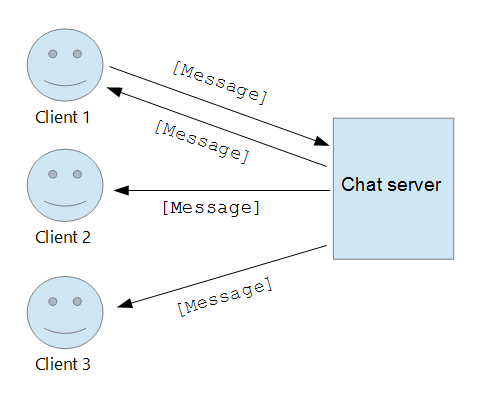
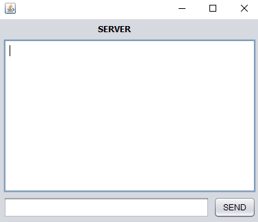
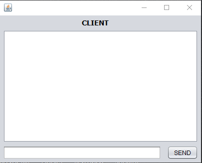
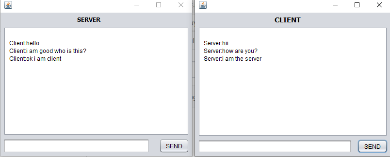
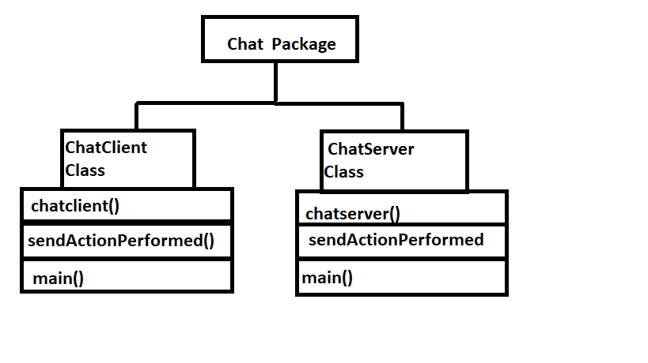

                                                     PROJECT    SYNOPSIS

OBJECTIVE: The objective of the project is to create a broadcasting chat server using JFrame technology.

INTRODUCTION TO BROADCASTING CHAT SERVER:
Chat server has two types of broadcasting. One is Public i.e. the message is broadcast to all connected users and another one is Private that means the broadcasting will be limited between two clients. Through the help of this project, the users can easily communicate and also interact with each other.

 
The chat server created in the project has a client and a server. There can be communication done between the two of these. The project is created using java language only. It was created on Netbeans. The project has two Frames -one for the client and one for the server.
The contents of the frame are as follows:
1. SERVER FRAME- It has a text_area to display the texts from the client (named as msg_area), a text_field to write texts to send to the client (named as msg_text) , a label to display the name to the frame as SERVER and a Jbutton to send the msg to the client (named as send).
2. CLIENT FRAME- It has a text_area to display the texts from the server (named as msg_area), a text_field to write texts to send to the client (named as msg_text) , a label to display the name to the frame as CLIENT and a Jbutton to send the msg to the server (named as send).
SOFTWARE REQUIREMENTS:
Language: Java
Platform: Any platform that supports JVM.
BASIC IDEA OF CREATING THE PROJECT:
The basic idea of creating the project was to understand advance java better. The topic chosen for the project is Broadcasting Chat Server. The main focus was on using JFrame technology in java.
DETAILED EXPLANATION OF PROJECT (With Steps):
Step-1: Creating a package – Firstly a new java project was created on NetBeans named myChatApplication. Under that project a new package was created (named chat package). Two new Jframes are created under this chat package (Server and Client).
Step-2: Designing the frame – NetBeans has drag and drop facility to design the frames. So the frames are just created using that only. There are two frames created:
1.	Server Frame – It has a text_area to display the texts from the client (named as msg_area), a text_field to write texts to send to the client (named as msg_text) , a label to display the name to the frame as SERVER and a Jbutton to send the msg to the client (named as send).
The text field was made static so that is can be accessed by the main method as main method is also static. The names of the attributes added to the JFrame are changed for self-convenience.
2.	Client Frame - It has a text_area to display the texts from the server (named as msg_area), a text_field to write texts to send to the server (named as msg_text) , a label to display the name to the frame as CLIENT and a Jbutton to send the msg to the server (named as send).
The text field was made static so that is can be accessed by the main method as main method is also static. The names of the attributes added to the JFrame are changed for self-convenience.
After these JFrames are created we try to run these. Below are the output after running both the JFames.
1. Below is the server frame given.

 
2. Below is the client frame given.

Tried sending message from server frame to client and vice versa but could not because the coding is left.
Step-3: Coding of Frame – Open to the JFrame and it has a option of coding in which half of the coding is already done due to drag and drop. Some additional coding that needs to be done is as follows;
1. Server Coding – Four static variables in class are created as follows and their packages are imported:
    static DataInputStream dis;
    static DataOutputStream dout;
    static ServerSocket ss;
    static Socket s;	
For coding the logic, create a string in the main method (here msgin) and initialize it as blank string. Make an object of ServerSocket (ss) and pass a port number (here used 1201, at this port number server socket will run).
After running server socket, server will accept the request of client by accept() mwethod and it will be stored in socket variable. An input and output stream object will be passed.
For receiving the message, we will have to start a while loop. The condition will be until msgin doesn’t equal to “End” you can read the messages.
We have to now show the message in msg area and erase the previous text of the text area and ensure that every new msg gets displayed in new line.
The code will look like:
  String msgin = "";
        try {
            ss = new ServerSocket(1111);
            s = ss.accept();
            dis = new DataInputStream(s.getInputStream());
            dout = new DataOutputStream(s.getOutputStream());
             while (!msgin.equals("End")) {
                msgin = dis.readUTF();
                msg_area.setText(msg_area.getText() + "\n Client:" + msgin);
            }
        } catch (Exception e) {
            //handle exception here
        }
You will now find a method written empty for button. To send msg to client we pass a string variable as msg and initialize it as empty string. After writing msg , empty the msg bit.
The send button code will look like:
private void sendActionPerformed(java.awt.event.ActionEvent evt) {                                     
   String msg="";
    try{ msg=msg_text.getText();
       dout.writeUTF(msg);
       msg_text.setText("");
    }
    catch(Exception e){
    }
    }                    
Note that all the code is written in try and catch block to avoid any exception error. 

1. Client Coding – Three static variables in class are created as follows and their packages are imported:
    static DataInputStream dis;
    static DataOutputStream dout;
    static Socket s;	
For coding the logic, create a string in the main method (here msgin) and initialize it as blank string. We will not make a server socket. We will here make a socket object to connect client to server running on 1201 port number. We have to pass two parameters (ip address, port number). Ip address is of local host because server is running on the same machine.
After running server socket, server will accept the request of client by accept() method and it will be stored in socket variable. An input and output stream object will be passed.
For receiving the message, we will have to start a while loop. The condition will be until msgin doesn’t equal to “End” you can read the messages.
We have to now show the message in msg area and erase the previous text of the text area and ensure that every new msg gets displayed in new line.
The code will look like;
String msgin = "";
        try {
            s=new Socket("localhost",1111);
            dis = new DataInputStream(s.getInputStream());
            dout = new DataOutputStream(s.getOutputStream());

            while (!msgin.equals("End")) {
                msgin = dis.readUTF();
                msg_area.setText(msg_area.getText()+"\n Server:"+msgin);
            }
        } catch (Exception e) {
            //handle exception here
        }
You will now find a method written empty for button. To send msg to client we pass a string variable as msg and initialize it as empty string. After writing msg, empty the msg bit.
The send button code will look like:
private void sendActionPerformed(java.awt.event.ActionEvent evt) {                                    
        String msg="";
    try{ msg=msg_text.getText();
       dout.writeUTF(msg);
       msg_text.setText("");
    }
    catch(Exception e){
    }
    }                
Note that all the code is written in try and catch block to avoid any exception error. 
Step:5 – Run the frame: Run both the frames by clicking on the right and pressing run file.
The project is completed now you can send message from server to client and viceversa.
OUTPUT:
Your conversation will look like this:
 
 DIAGRAM:
 

 

